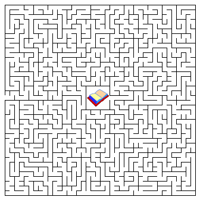
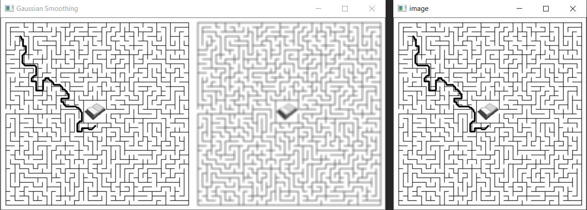

## Custom Path Finder
This is a project which finds path between starting and ending position
using A Star algorithm. It reads the maze image from a directory. 
Give the starting and ending coordinates on line 210 and 211.
And this will provide you the path between your coordinates.

## Status 
This is working fine for some coordinatess. But for some coordinates lines 
seems to be going over the maze boundry. Still working hope someday 
i will find the solution!!!
 